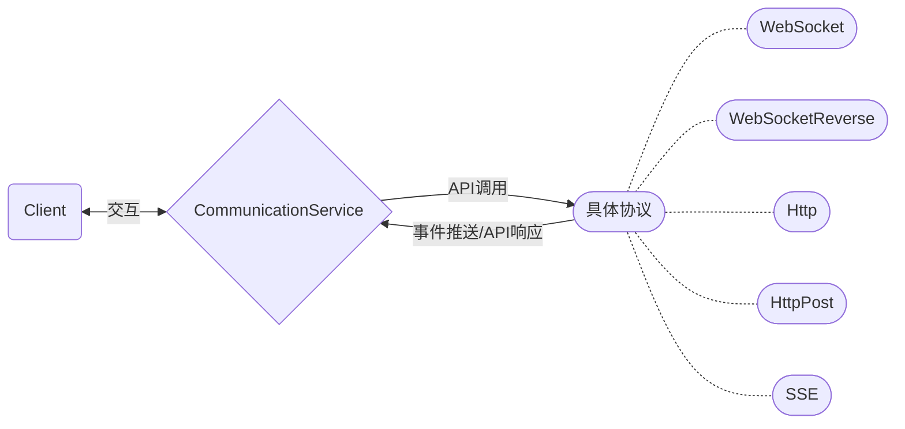
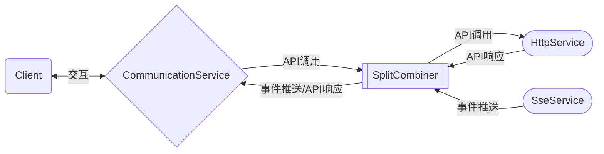
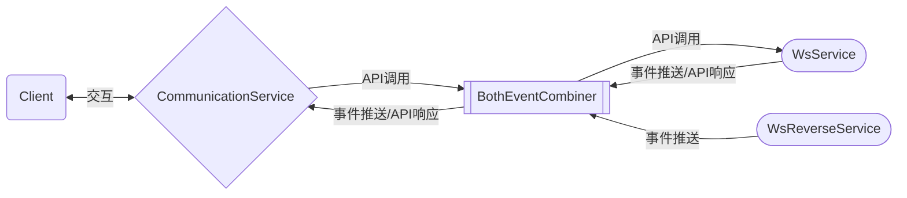
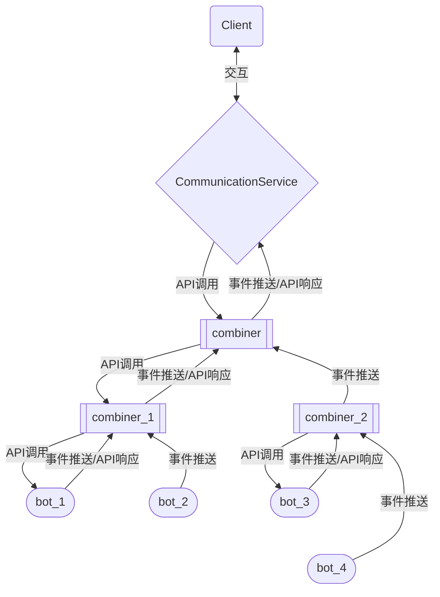

# Onebot API

[](https://crates.io/crates/onebot-api)
[](https://github.com/Ecamika/onebot-api)

库如其名，这是一个Onebot V11协议的实现  
目前已完成对Onebot V11协议所有API的实现

> **Requirements**: Rust >= 1.85 (Edition 2024)

# Features

默认启用 `full` feature，包含所有协议模块。可按需选择：

| Feature | 说明 |
|---------|------|
| `websocket` | 正向 WebSocket |
| `websocket-reverse` | 反向 WebSocket |
| `http` | HTTP API 调用 |
| `http-post` | HTTP Post 事件上报 |
| `sse` | Server-Sent Events |
| `combiner` | 组合器 (SplitCombiner / BothEventCombiner) |
| `quick_operation` | 快速操作 trait |
| `selector` | 事件选择器 |
| `rustls` | 使用 rustls 作为 TLS 后端 |
| `native-tls` | 使用 native-tls 作为 TLS 后端 |

```toml
[dependencies]
onebot-api = { version = "1.2", default-features = false, features = ["websocket", "http"] }
```

# 核心概念

## `Client`

`Client` 是高层客户端的入口，封装了API调用、事件推送等核心逻辑层服务  
`Client` 内部使用了 `flume` 作为API调用通道（***mpsc***），`tokio broadcast` 作为事件通道（***mpmc***）  
在与底层协议的交互方面，`Client` 内部使用了 **特征对象** 和 **依赖注入** ，这使得 `Client` 具备 **协议无关** 的特性  
因此，`Client` 需要且仅需要专注于 **API调用** 与 **事件推送** 等核心逻辑层服务，对于底层协议的交互，则使用外部依赖实现  
由此，`Client` 实现了逻辑层与协议层的解耦，也使得 `Client` 具备运行时切换底层协议的能力  
另外，由于 `Client` 与底层协议交互时使用了消息通道  
因此，`Client` 天然具备 **线程安全** 并且不需要锁来防止竞态条件（`Arc<Client>`🤓☝️ | `Arc<Mutex<Client>>`👎😡）  
对于资源管理方面，`Client` 实现了 `Drop` 特征，在 `Client` 析构时会自动清理其产生的所有资源  
但 `Client` 并不会清理外部依赖所产生的资源，这依赖于外部依赖的析构函数（本库中所有实现了 `CommunicationService` 的结构都实现了
`Drop` 特征）

## `ClientBuilder`

`ClientBuilder` 提供了更灵活的方式来构造 `Client`，支持自定义通道容量、超时时间和 echo 生成器：

```rust
use std::time::Duration;
use onebot_api::communication::utils::Client;
use onebot_api::communication::ws::WsService;

let client = Client::builder(WsService::new("wss://example.com".parse().unwrap(), None))
    .timeout(Duration::from_secs(5))
    .union_channel_cap(32)
    .build();
```

## `CommunicationService`

`CommunicationService` 是 `Client` 与底层协议交互的基础  
任意实现了 `CommunicationService` 特征 的结构都可作为与 `Client` 交互的服务

---
目前已实现的协议：

- 正向 WebSocket
- 反向 WebSocket
- SSE
- Http
- Http Post



# Usage

## Client用法

```rust
use std::time::Duration;
use onebot_api::api::APISender;
use onebot_api::communication::utils::Client;
use onebot_api::communication::ws::WsService;
use onebot_api::text;

#[tokio::main]
async fn main() {
	let ws_service = WsService::new("wss://example.com".parse().unwrap(), Some("example_token".to_string()));
	let client = Client::new_with_timeout(ws_service, Some(Duration::from_secs(5)));
	client.start_service().await.unwrap();

	let msg_id = client.send_private_msg(123456, text!("this is a {}", "message"), None).await.unwrap();
	client.send_like(123456, Some(10)).await.unwrap();

	let mut event_receiver = client.get_normal_event_receiver();
	while let Ok(event) = event_receiver.recv().await {
		println!("{:#?}", event)
	}
}
```

## 正向WebSocket

```rust
use std::time::Duration;
use onebot_api::communication::utils::Client;
use onebot_api::communication::ws::WsService;

#[tokio::main]
async fn main() {
	let ws_service = WsService::new("wss://example.com".parse().unwrap(), Some("example_token".to_string()));
	let client = Client::new_with_timeout(ws_service, Some(Duration::from_secs(5)));
	client.start_service().await.unwrap();
}
```

## 反向WebSocket

```rust
use onebot_api::communication::utils::Client;
use onebot_api::communication::ws_reverse::WsReverseService;
use std::time::Duration;

#[tokio::main]
async fn main() {
	let ws_reverse_service = WsReverseService::new("0.0.0.0:8080", Some("example_token".to_string()));
	let client = Client::new_with_timeout(ws_reverse_service, Some(Duration::from_secs(5)));
	client.start_service().await.unwrap();
}
```

## Http

```rust
use onebot_api::communication::utils::Client;
use std::time::Duration;
use onebot_api::communication::http::HttpService;

#[tokio::main]
async fn main() {
	let http_service = HttpService::new("https://example.com", Some("example_token".to_string())).unwrap();
	let client = Client::new_with_timeout(http_service, Some(Duration::from_secs(5)));
	client.start_service().await.unwrap();
}
```

## Http Post

```rust
use onebot_api::communication::utils::Client;
use std::time::Duration;
use onebot_api::communication::http_post::HttpPostService;

#[tokio::main]
async fn main() {
	let http_post_service = HttpPostService::new("0.0.0.0:8080", None, Some("example_secret".to_string())).unwrap();
	let client = Client::new_with_timeout(http_post_service, Some(Duration::from_secs(5)));
	client.start_service().await.unwrap();
}
```

## SSE

```rust
use onebot_api::communication::utils::Client;
use std::time::Duration;
use onebot_api::communication::sse::SseService;

#[tokio::main]
async fn main() {
	let sse_service = SseService::new("https://example.com/_events", Some("example_token".to_string())).unwrap();
	let client = Client::new_with_timeout(sse_service, Some(Duration::from_secs(5)));
	client.start_service().await.unwrap();
}
```

## 组合器

同时，该库设计了组合器来将不同的底层连接放在同一个Client上  
例如，你可以创建一个SseService和一个HttpService，同时通过组合器将它们放在同一个Client上  
其行为与直接用WsService并无差别

### `SplitCombiner`

将事件接收与API发送分为两个不同服务实现  
服务分为 `send_side` 与 `read_side`  
其中，`send_side` 负责API发送服务，`read_side` 负责事件接收服务  
`send_side` 的事件通道由一个 processor task 负责  
processor 将 `send_side` 的API响应事件并入原事件通道，其余事件丢弃

```rust
use onebot_api::communication::utils::Client;
use std::time::Duration;
use onebot_api::communication::combiner::SplitCombiner;
use onebot_api::communication::http::HttpService;
use onebot_api::communication::sse::SseService;

#[tokio::main]
async fn main() {
	let sse_service = SseService::new("https://example.com/_events", Some("example_token".to_string())).unwrap();
	let http_service = HttpService::new("https://example.com", Some("example_token".to_string())).unwrap();
	let combiner = SplitCombiner::new(http_service, sse_service);
	let client = Client::new_with_timeout(combiner, Some(Duration::from_secs(5)));
	client.start_service().await.unwrap();
}
```



#### TIPS

传统的 WebSocket 并不支持 HTTP 3，但是 SSE 支持 HTTP 3  
因此，最初设计 `SplitCombiner` 时，就是用来组合 `HttpService` 和 `SseService`  
这样既可以享受 HTTP 3 带来的优势，同时在使用体验上也不输 WebSocket

### `BothEventCombiner`

详见 `SplitCombiner`  
与 `SplitCombiner` 的区别在于  
`BothEventCombiner` 会将 `send_side` 的所有事件均并入原事件通道  
因此，`BothEventCombiner` 不存在 processor task

```rust
use onebot_api::communication::combiner::BothEventCombiner;
use onebot_api::communication::ws_reverse::WsReverseService;
use onebot_api::communication::utils::Client;
use onebot_api::communication::ws::WsService;
use std::time::Duration;

#[tokio::main]
async fn main() {
	let ws_service = WsService::new("wss://example.com".parse().unwrap(), Some("example_token".to_string()));
	let ws_reverse_service = WsReverseService::new("0.0.0.0:8080", Some("example_token".to_string()));
	let combiner = BothEventCombiner::new(ws_service, ws_reverse_service);
	let client = Client::new_with_timeout(combiner, Some(Duration::from_secs(5)));
	client.start_service().await.unwrap();
}
```



### TIPS

对于组合器，组合器与组合器之间也是可以被组合器所连接的  
因此，对于一个bot消息集群，可以通过多个 `BothEventCombiner` 来实现同一个client接收所有消息

```rust
use std::time::Duration;
use onebot_api::communication::combiner::BothEventCombiner;
use onebot_api::communication::http_post::HttpPostService;
use onebot_api::communication::sse::SseService;
use onebot_api::communication::utils::Client;
use onebot_api::communication::ws::WsService;
use onebot_api::communication::ws_reverse::WsReverseService;

#[tokio::main]
async fn main() {
	let bot_1 = WsService::new("ws://127.0.0.1:5000".parse().unwrap(), None);
	let bot_2 = WsReverseService::new("127.0.0.1:6000", None);
	let bot_3 = SseService::new("http://127.0.0.1:7000", None).unwrap();
	let bot_4 = HttpPostService::new("127.0.0.1:8000", None, None).unwrap();

	let combiner_1 = BothEventCombiner::new(bot_1, bot_2);
	let combiner_2 = BothEventCombiner::new(bot_3, bot_4);

	let combiner = BothEventCombiner::new(combiner_1, combiner_2);

	let client = Client::new_with_timeout(combiner, Some(Duration::from_secs(5)));
	client.start_service().await.unwrap();
}
```



### 何时使用哪种组合器？

- 使用 `SplitCombiner`：当你明确分离 **发送** 和 **接收** 时（例如刚才提到的 `SseService` 和 `HttpService`）
- 使用 `BothEventCombiner`：当你需要聚合多个独立bot实例的事件流

## `SegmentBuilder`

Onebot V11协议中，在发送消息时需要构造Segment Array  
库提供了所有Send Segment的类型，但手动构造它们还是太麻烦了  
于是就有了 `SegmentBuilder`

```rust
use std::time::Duration;
use onebot_api::api::APISender;
use onebot_api::communication::utils::Client;
use onebot_api::communication::ws::WsService;
use onebot_api::message::SegmentBuilder;

#[tokio::main]
async fn main() {
	let client = Client::new_with_timeout(WsService::new("ws://localhost:8080".parse().unwrap(), None), Some(Duration::from_secs(5)));
	client.start_service().await.unwrap();

	let segment = SegmentBuilder::new()
		.text("this is an apple")
		.image("https://example.com/apple.png")
		.text("\n")
		.text("this is a banana")
		.image("https://example.com/banana.png")
		.build();

	client.send_private_msg(123456, segment, None).await.unwrap();
}
```

当然，`image` 中的选项很多，如果你希望的话，库也提供了部分 `segment` 的 `builder`

```rust
use onebot_api::message::SegmentBuilder;

#[tokio::main]
async fn main() {
	let segment = SegmentBuilder::new()
		.text("this")
		.image_builder("https://example.com/apple.png")
		.cache(true)
		.timeout(5)
		.proxy(true)
		.build()
		.text("is an apple")
		.build();
}
```

当然，bot发送消息大部分情况都只是文本  
每次都要创建 `SegmentBuilder` 还是太麻烦了  
于是就有了 `text` 宏

```rust
use std::time::Duration;
use onebot_api::api::APISender;
use onebot_api::communication::utils::Client;
use onebot_api::communication::ws::WsService;
use onebot_api::text;

#[tokio::main]
async fn main() {
	let client = Client::new_with_timeout(WsService::new("ws://localhost:8080".parse().unwrap(), None), Some(Duration::from_secs(5)));
	client.start_service().await.unwrap();

	let msg = "123456".to_string();
	client.send_private_msg(123456, text!("this is a message: {}", msg), None).await.unwrap();
}
```

在 `text` 宏的内部使用了 `format` 宏  
因此，你可以像使用 `println` 宏一样使用 `text` 宏

## quick_operation
有时候，我们收到了一个事件，我们想直接对这个事件进行操作
此时，若调用 `client` 上的对应api，效率未免太低了，还要一个个传参
于是，我们提供了 quick_operation
quick_operation 是一系列快速操作trait，用户可以直接在事件上进行对应的操作

目前已实现的 quick operation trait：

- `QuickSendMsg` - 快速发送消息
- `QuickReplyAt` - 快速回复并@某人
- `QuickDeleteMsg` - 快速删除消息
- `QuickKick` - 快速踢出群成员
- `QuickBan` - 快速禁言群成员
- `QuickHandleFriendRequest` - 快速处理好友请求
- `QuickHandleGroupRequest` - 快速处理群请求

## `selector`

`selector` feature 现在基于可选依赖 `tynavi` 提供不可变链式选择器。启用后，事件和消息段类型会派生 tynavi selector API，可使用 `as_selector()`、`route_*()`、`*_filter()`、`is_*()` 等方法逐层筛选。

```rust
use onebot_api::communication::utils::Client;
use onebot_api::communication::ws::WsService;
use onebot_api::event::{EventSelector, KnownEventSelector, EventMessageSelector};
use onebot_api::event::message::{MessageEventSelector, MessageEventGroupSelector};
use onebot_api::quick_operation::QuickSendMsg;
use onebot_api::selector::AsSelector;
use onebot_api::text;

#[tokio::main]
async fn main() {
	let ws_service = WsService::new("wss://example.com".parse().unwrap(), Some("example_token".to_string()));
	let mut client = Client::new(ws_service);
	client.start_service().await.unwrap();
	let mut r = client.get_normal_event_receiver();
	while let Ok(event) = r.recv_async().await {
		event
			.as_selector()
			.route_known()
			.route_message()
			.self_id_filter(|self_id, _| *self_id == 123456)
			.route_data()
			.as_ref()
			.route_group()
			.user_id_filter(|user_id, _| *user_id == 114514)
			.raw_message_filter(|msg, _| msg.starts_with("/command"))
			.is_normal()
			.extract_async(async |event, _| {
				event
					.send_msg(&client, text!("this is a command"), None)
					.await
			})
			.await
			.expect("not matched")
			.expect("can not send message");
	}
}
```

以下是基于 NapCat 扩展 API 实现 `/戳` 指令的示例：

```rust
use onebot_api::communication::utils::Client;
use onebot_api::communication::ws::WsService;
use onebot_api::event::{EventSelector, KnownEventSelector, EventMessageSelector};
use onebot_api::event::message::{MessageEventSelector, MessageEventGroupSelector};
use onebot_api::extension::napcat::api::NapCatAPISender;
use onebot_api::message::receive_segment::ReceiveSegment;
use onebot_api::selector::AsSelector;
use url::Url;

#[tokio::main]
async fn main() {
	let s = WsService::new(Url::parse("wss://example.com").unwrap(), None);
	let mut client = Client::new(s);
	client.start_service().await.unwrap();
	let receiver = client.get_normal_event_receiver();
	while let Ok(event) = receiver.recv_async().await {
		event
			.as_selector()
			.route_known()
			.route_message()
			.route_data()
			.as_ref()
			.route_group()
			.message_filter(|message, _| matches!(
				message.as_slice(),
				[
					ReceiveSegment::Text(text),
					ReceiveSegment::At(at),
					..
				] if text.text.starts_with("/戳") && at.qq.is_id()
			))
			.extract_async(async |event, _| {
				let ReceiveSegment::At(at) = &event.message[1] else {
					return;
				};
				let user_id: i64 = match &at.qq {
					onebot_api::message::utils::AtType::Id(qq) => qq.parse().unwrap(),
					onebot_api::message::utils::AtType::All => return,
				};
				client.group_poke(event.group_id, user_id).await.unwrap();
			})
			.await;
	}
}
```

## `EventBroadcastDecorator`

`EventBroadcastDecorator` 包装了 `Client`，将事件从 flume channel 转发到 `tokio::broadcast` channel，支持多个订阅者同时接收事件：

```rust
use std::time::Duration;
use onebot_api::communication::utils::Client;
use onebot_api::communication::ws::WsService;
use onebot_api::communication::decorator::EventBroadcastDecorator;

#[tokio::main]
async fn main() {
	let client = Client::new(WsService::new("ws://localhost:8080".parse().unwrap(), None));
	client.start_service().await.unwrap();

	let decorator = EventBroadcastDecorator::new(client, 16);
	let mut receiver_1 = decorator.subscribe();
	let mut receiver_2 = decorator.subscribe();

	tokio::spawn(async move {
		while let Ok(event) = receiver_1.recv().await {
			println!("receiver 1: {:#?}", event);
		}
	});

	while let Ok(event) = receiver_2.recv().await {
		println!("receiver 2: {:#?}", event);
	}
}
```

`EventBroadcastDecorator` 实现了 `Deref` / `DerefMut`，因此可以直接在其上调用 `Client` 的所有方法。

# Todo List

- `WsService` 自动重连 ✅
- `SseService` 自动重连 ❌ *（目前还没有方法能够在SSE连接突然断开后获得通知）*
- 更精细化的错误处理
	- `Client` 实现无 `anyhow::Result` ✅
	- 服务 task 实现无 `anyhow::Result` ✅
	- 取消服务 task 错误静默处理
- 更完善的文档注释
- 自定义Event反序列化 ✅? （感觉没啥用，直接用 `extra_body` 字段代替了）
- 更多的API！
	- napcat API
	- go-cqhttp API
